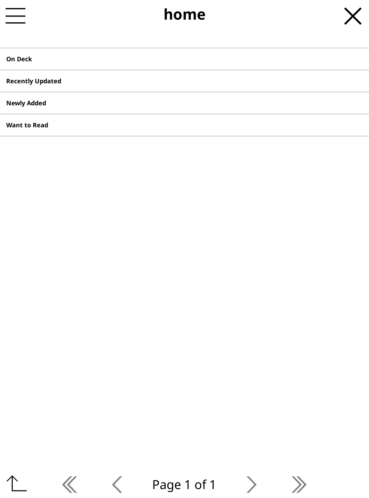
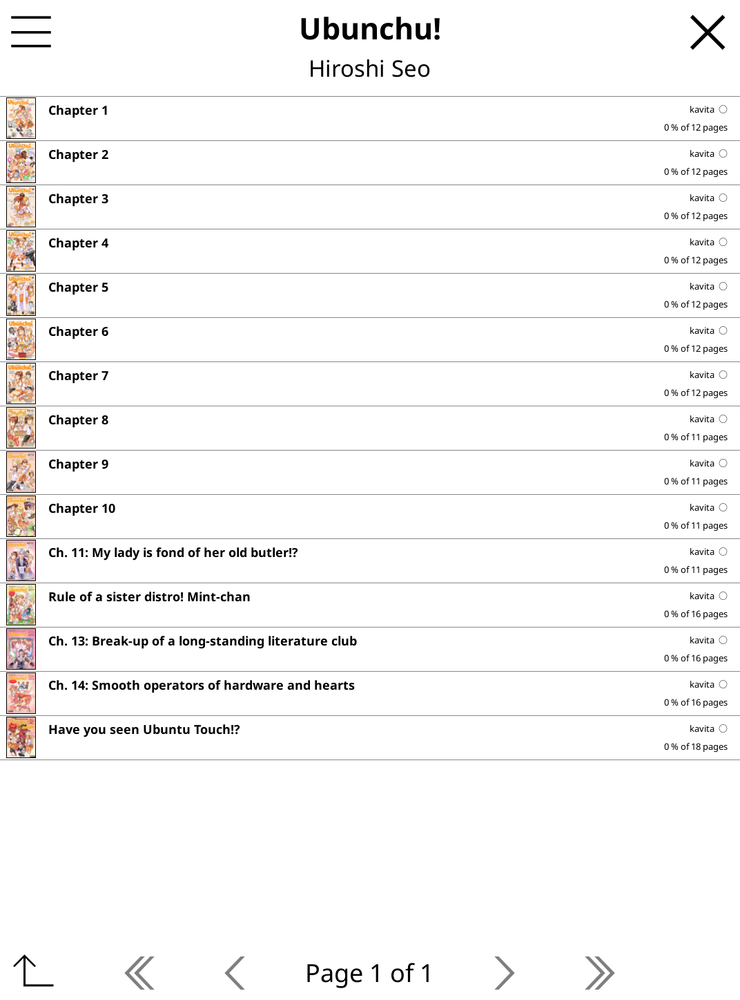
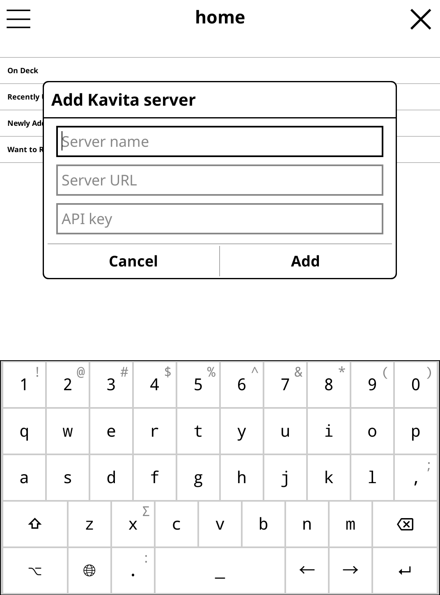

# Kamare (kamare.koplugin)

**kamare** (originally created by [fpammer](https://github.com/fpammer)) is a manga reader plugin for [KOReader](https://github.com/koreader/koreader) that 
connects to [Kavita](https://github.com/Kareadita/Kavita) and [Komga](https://komga.org/).

This KOReader plugin provides a seamless way to read manga from Kavita without going through OPDS, 
featuring a custom renderer that also supports long-strip formats commonly used in manhwa.

## Features

- **Direct Kavita/Komga Integration** - Browse your library without OPDS limitations
- **Multiple Reading Modes** - Page, scroll (long-strip), and dual-page modes
- **Smart Prefetching** - Fast page turns through caching
- **Progress Tracking** - Syncs with Kavita and KOReader reading stats
- **Optimized Renderer** - Custom-built for fluid manga reading experience

Tested with Kindle Paperwhite (2nd gen) and Kobo Libra Colour.

## Screenshots

<table>
<tr>
<td align="center" valign="top">

 <b>Library Home</b>
 Browse by On Deck, Recently Updated, and Want to Read
</td>
<td align="center" valign="top">

 <b>Chapter List</b>
 View all chapters with progress tracking
</td>
</tr>
</table>

## Reading Modes

<table>
<tr>
<td align="center" valign="top">

 <b>Page Mode</b>
 Classic single-page view
</td>
<td align="center" valign="top">

 <b>Scroll Mode</b>
 For webtoons and long-strip formats
</td>
<td align="center" valign="top">

 <b>Dual Page Mode</b>
 More Book like horizontally or on wider screens
</td>
</tr>
</table>

## Installation & Setup

1. Download the latest `kamare.koplugin.zip` from the [releases page](https://github.com/skyuk3000/kamare.koplugin/releases/latest).
2. Extract the ZIP and copy the `kamare.koplugin` folder into the `plugins` directory of your KOReader installation.
3. Restart KOReader to load the plugin.
4. Open the plugin from the KOReader menu (🔍) and add a server from the burger menu (top-left).:

5. Enter a server name, URL, and credentials:
   - **Kavita**: set server type to `kavita` and provide API key
   - **Komga**: set server type to `komga` and provide username/password

### Getting Your Kavita API Key

1. Log into your Kavita web interface
2. Go to **Settings** → **Account** → **API Key**
3. Generate a new key if needed and type it to the setup dialog

## Configuration

Access settings while reading by tapping the screen. Customize your experience:

- **View Modes**: Switch between scroll, page, and dual-page modes
- **Page Direction**: LTR or RTL
- **Prefetching**: Prefetch next pages for smooth reading
- **Render Quality**: Balance between quality and speed (also helps with older devices, or crazy files)

<b>View all settings</b>

<table>
<tr>
<td align="center" valign="top">

 <b>General</b>
</td>
<td align="center" valign="top">

 <b>Page</b>
</td>
<td align="center" valign="top">

 <b>Zoom</b>
</td>
</tr>
</table>

